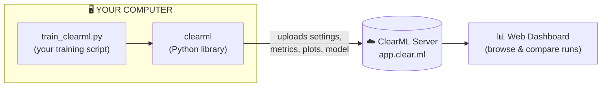

# 2.2 Experiment Tracking with ClearML 🧪

> ✅ **This is the reference "completed module"** — it shows the depth every other module
> will reach. Beginner hands-on guide; assumes you know **nothing** about ClearML.
> By the end you'll have a YOLO training auto-tracked in a web dashboard, and understand *why*.
>
> ⏱️ ~15 minutes · 💻 No GPU required · 📖 Roadmap: [§2.2](../../roadmap.md#22-experiment-tracking)

---

## Why bother? (the 60-second version)

Imagine it's a month from now. You've trained YOLO **ten times** — different learning
rates, datasets, and epoch counts. Someone asks:

> *"Which run got the best accuracy, and what exact settings produced it?"*

Without tracking, you're staring at folders named `runs/train`, `runs/train2`,
`runs/train3`… with **zero memory** of what was different. 😵

**Experiment tracking** fixes this. ClearML silently records *every* run — the settings,
the metrics, the plots, even your exact code and installed packages — into one searchable
web dashboard. It's the **first MLOps habit** worth building, and it costs ~2 lines of code.

---

## What *is* ClearML, in plain English?

ClearML is made of **three pieces**:



1. **The `clearml` library (SDK)** — ~2 lines in your training script; ships data out.
2. **The ClearML server** — stores every run. Use the **free hosted** one at
   [app.clear.ml](https://app.clear.ml) (nothing to install).
3. **The web dashboard** — where you *see* runs, open plots, and compare them.

> 🔑 **Vocabulary:** a **Task** = one tracked experiment = one training run.

---

## Prerequisites
- [ ] Python + Ultralytics working (you can run `model.train()`)
- [ ] A terminal with your virtual environment **activated**
- [ ] ~15 minutes

---

## Step 1 — Create a free ClearML account
1. Go to **[app.clear.ml](https://app.clear.ml)** and sign up (Google/GitHub is fine).

## Step 2 — Connect your computer
```bash
pip install clearml
clearml-init
```
`clearml-init` asks you to **paste credentials**:
1. Dashboard → **Settings** → **Workspace** → **Create new credentials**
2. Copy the **entire** block (from `api {` to the closing `}`)
3. Paste into the terminal, press Enter → expect *"…Success!"*

> 🧯 **Common snag:** pasting only part of the block. Copy the *whole* thing.

## Step 3 — Run a tracked training
The script [`train_clearml.py`](train_clearml.py) is ready. Its only ClearML-specific lines:
```python
from clearml import Task
task = Task.init(project_name="YOLO-MLOps-Learning", task_name="clearml-first-run")
```
Run it:
```bash
python train_clearml.py
```
Trains on `coco8` (8 images, ~1–2 min on CPU). Everything else is normal YOLO — Ultralytics'
built-in integration auto-logs the metrics.

## Step 4 — See the payoff 🎉
Open **[app.clear.ml](https://app.clear.ml)** → project **`YOLO-MLOps-Learning`** → your run:

| In the dashboard | What it means |
|------------------|---------------|
| **Scalars** | Live graphs of loss ↓ and **mAP** ↑ |
| **Plots** | Confusion matrix, PR curves |
| **Debug Samples** | Images with predicted boxes |
| **Configuration** | Every setting — your reproducibility record |
| **Console** | The full training log |

---

## Try this next (where it clicks) 🔁
1. Run again with `epochs=20` (edit `train_clearml.py`).
2. In the dashboard, select **both** runs → **Compare** → see metrics overlaid.
3. Answering *"which settings won?"* is now a 5-second glance.

## What you learned
- [ ] What experiment tracking is and the problem it solves
- [ ] ClearML's 3 pieces (SDK · server · dashboard) and what a **Task** is
- [ ] How to connect (`clearml-init`) and track (`Task.init`) a YOLO run
- [ ] How to compare runs

**Next (Part 2):** dataset versioning (`clearml-data`), remote agents, and HPO.

📖 [Ultralytics × ClearML](https://docs.ultralytics.com/integrations/clearml)
