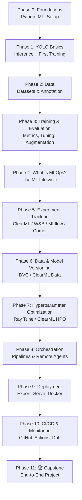

# 🎯 YOLO + MLOps: From 0 to Hero — Learning Roadmap

> A beginner-friendly, hands-on roadmap to learn **YOLO** (object detection) and wrap it in a
> production-grade **MLOps** workflow — starting from absolute zero.
>
> Inspired by the [Ultralytics ClearML integration](https://docs.ultralytics.com/integrations/clearml),
> but covering **all** the major MLOps tools so you can pick what fits you.

---

## 📌 How to use this roadmap

- Work **top to bottom**. Each phase builds on the previous one.
- Check the boxes `[ ]` → `[x]` as you finish things (this file is your progress tracker).
- Every phase has a **🛠️ Hands-on** mini-project. **Do not skip these** — you learn by building.
- ⏱️ Time estimates assume ~1 hour/day. Go faster or slower, it's your pace.
- 🟢 = beginner · 🟡 = intermediate · 🔴 = advanced

> **Golden rule:** Get YOLO *working* first (Phases 0–3). Only then add MLOps tooling
> (Phases 4+). MLOps on top of a model you don't understand is just confusion.

---

## 🗺️ The big picture



---

## ✅ Prerequisites (the honest list)

You do **not** need a PhD. You need:

- [ ] Basic computer literacy + comfort with installing software
- [ ] Willingness to use a **terminal/command line** (we'll go slow)
- [ ] A computer (a GPU helps but is **not** required — free cloud GPUs work great)
- [ ] A [GitHub account](https://github.com) (free)
- [ ] Curiosity and patience 🙂

**No GPU? No problem.** Use [Google Colab](https://colab.research.google.com) or
[Kaggle Notebooks](https://www.kaggle.com/code) — both give free GPU time.

---

# Phase 0 — Foundations 🟢
**⏱️ ~1–2 weeks** · *Goal: be dangerous with Python and understand what ML is.*

You can learn YOLO with surprisingly little theory, but these basics make everything click.

### Topics
- [ ] **Python basics** — variables, lists/dicts, loops, functions, imports
- [ ] **The terminal** — `cd`, `ls`/`dir`, running scripts, pip
- [ ] **Virtual environments** — why they exist, `venv` / `conda`
- [ ] **NumPy** — arrays (images are just arrays of numbers!)
- [ ] **What is Machine Learning** — training vs. inference, model, dataset, labels
- [ ] **What is a neural network** (intuition only, no heavy math)
- [ ] **What is Computer Vision** — pixels, images, bounding boxes
- [ ] **Git basics** — `clone`, `add`, `commit`, `push` (you'll use this constantly)

### 🛠️ Hands-on
1. Install **Python 3.11+** and set up a virtual environment:
   ```bash
   python -m venv .venv
   # Windows:
   .venv\Scripts\activate
   # macOS/Linux:
   source .venv/bin/activate
   ```
2. `pip install numpy` and play with arrays in a Python shell.
3. Create your first Git repo and push a "hello world" to GitHub.

### 📚 Resources
- [Python for Beginners (official)](https://www.python.org/about/gettingstarted/)
- [freeCodeCamp — Python Full Course](https://www.youtube.com/watch?v=rfscVS0vtbw)
- [Git & GitHub for beginners](https://www.youtube.com/watch?v=RGOj5yH7evk)
- [3Blue1Brown — Neural Networks (intuition)](https://www.youtube.com/playlist?list=PLZHQObOWTQDNU6R1_67000Dx_ZCJB-3pi)

---

# Phase 1 — YOLO Fundamentals 🟢
**⏱️ ~1 week** · *Goal: run YOLO on an image and train your first model.*

### What is YOLO?
**YOLO** = *You Only Look Once*. It's a family of real-time **object detection** models —
they draw boxes around objects in images/video and label them. The modern, easiest-to-use
version is maintained by **Ultralytics** (latest flagship models: **YOLO11** and **YOLO26**).

> 💡 YOLO can do more than detection: **segmentation**, **classification**, **pose
> estimation**, and **oriented bounding boxes (OBB)** — all from one library.

### Topics
- [ ] Object detection vs. classification vs. segmentation
- [ ] The YOLO lineage (v1–v4 → YOLOv5 → v8 → v11 → YOLO26) — just the gist
- [ ] Install the `ultralytics` package
- [ ] Pretrained models & model sizes (n/s/m/l/x — speed vs. accuracy tradeoff)
- [ ] Run **inference** (predict) on images, video, and webcam
- [ ] The CLI (`yolo ...`) vs. the Python API
- [ ] Understand the output: boxes, confidence scores, class labels

### 🛠️ Hands-on
```bash
pip install ultralytics
```
```python
from ultralytics import YOLO

# Load a pretrained model (downloads automatically)
model = YOLO("yolo11n.pt")          # 'n' = nano = smallest/fastest

# Run inference on a sample image
results = model("https://ultralytics.com/images/bus.jpg")
results[0].show()                    # see the detections!
```
Or with the CLI:
```bash
yolo predict model=yolo11n.pt source="https://ultralytics.com/images/bus.jpg"
```

### 📚 Resources
- [Ultralytics Quickstart](https://docs.ultralytics.com/quickstart/)
- [Ultralytics Docs — Home](https://docs.ultralytics.com/)
- [Predict mode](https://docs.ultralytics.com/modes/predict/)

---

# Phase 2 — Data: The Heart of ML 🟢🟡
**⏱️ ~1–2 weeks** · *Goal: understand, find, and create datasets in YOLO format.*

> 🔑 In ML, **data quality beats model cleverness** almost every time. This phase matters
> more than people think.

### Topics
- [ ] The **YOLO dataset format** (`images/`, `labels/`, `data.yaml`)
- [ ] What a label file looks like: `class x_center y_center width height` (normalized)
- [ ] Public datasets: COCO, VOC, Open Images, and Ultralytics sample sets (`coco8`)
- [ ] **Annotation/labeling** your own images — tools:
  - [ ] [Roboflow](https://roboflow.com/) (easiest, cloud)
  - [ ] [Label Studio](https://labelstud.io/) (open-source)
  - [ ] [CVAT](https://www.cvat.ai/) (powerful, open-source)
- [ ] Train/validation/test splits — and why you never peek at test
- [ ] Class imbalance & common dataset pitfalls

### 🛠️ Hands-on
1. Download and explore the tiny `coco8` dataset (8 images) — open a label `.txt` and
   decode it by hand.
2. Collect **20–50 images** of something you care about (e.g., your pet, mugs, plants).
3. Annotate them in Roboflow or Label Studio, export in **YOLO format**.
4. Write the `data.yaml` (paths + class names).

### 📚 Resources
- [Ultralytics — Datasets overview](https://docs.ultralytics.com/datasets/)
- [Detection dataset format](https://docs.ultralytics.com/datasets/detect/)
- [Roboflow — How to label](https://blog.roboflow.com/labelimg/)

---

# Phase 3 — Training & Evaluation 🟡
**⏱️ ~2 weeks** · *Goal: train YOLO on your own data and read the metrics like a pro.*

### Topics
- [ ] The **training loop**: epochs, batches, learning rate, loss
- [ ] Training YOLO on your custom dataset (CLI + Python)
- [ ] **Evaluation metrics** — this is crucial:
  - [ ] Precision & Recall
  - [ ] **mAP@50** and **mAP@50-95** (the headline metrics)
  - [ ] Confusion matrix, PR curves
  - [ ] IoU (Intersection over Union)
- [ ] **Overfitting vs. underfitting** — how to spot it in the curves
- [ ] **Data augmentation** (mosaic, flip, HSV, etc.) and why it helps
- [ ] Key **hyperparameters**: `epochs`, `imgsz`, `batch`, `lr0`, `patience`
- [ ] Transfer learning & freezing layers
- [ ] Reading the `runs/` output folder (the local results live here)

### 🛠️ Hands-on
```python
from ultralytics import YOLO

model = YOLO("yolo11n.pt")
results = model.train(
    data="path/to/your/data.yaml",
    epochs=50,
    imgsz=640,
    batch=16,
    patience=10,        # early stopping
)

metrics = model.val()   # evaluate on the validation set
print(metrics.box.map)  # mAP@50-95
```
- Train on the dataset **you** built in Phase 2.
- Inspect `runs/detect/train/` — look at `results.png`, `confusion_matrix.png`,
  and the loss curves. **Diagnose** whether your model overfit.

### 📚 Resources
- [Ultralytics — Train mode](https://docs.ultralytics.com/modes/train/)
- [Ultralytics — Val mode & metrics](https://docs.ultralytics.com/modes/val/)
- [YOLO performance metrics guide](https://docs.ultralytics.com/guides/yolo-performance-metrics/)

> ✋ **Checkpoint:** If you can train a model, read its mAP, and explain whether it
> overfit — you now *understand YOLO*. Everything below is about doing this
> **reproducibly, at scale, and in production**. Welcome to MLOps. 👇

---

# Phase 4 — What is MLOps? 🟡
**⏱️ ~3–5 days** · *Goal: understand the problem MLOps solves before touching tools.*

### The problem
You trained a great model. But... *Which data version was it?* *What hyperparameters?*
*Can a teammate reproduce it?* *How do you deploy it?* *Is it still accurate next month?*
**MLOps** = DevOps for machine learning — the practices & tools that make ML
**reproducible, automated, deployable, and monitored**.

### The MLOps lifecycle (mental model)
```
Data → Experiment → Train → Evaluate → Version → Deploy → Monitor → (loop back)
```

### Topics
- [ ] Why notebooks-only workflows break down
- [ ] **Reproducibility** — code + data + config + environment + seed
- [ ] The 5 pillars you'll learn next:
  1. **Experiment tracking** (Phase 5)
  2. **Data/model versioning** (Phase 6)
  3. **Hyperparameter optimization** (Phase 7)
  4. **Orchestration/pipelines** (Phase 8)
  5. **Deployment + monitoring** (Phases 9–10)
- [ ] MLOps maturity levels (manual → automated → fully CI/CD)

### 📚 Resources
- [Google — MLOps: Continuous delivery for ML](https://cloud.google.com/architecture/mlops-continuous-delivery-and-automation-pipelines-in-machine-learning)
- [ml-ops.org — principles](https://ml-ops.org/)
- [Made With ML — MLOps course (free)](https://madewithml.com/)

---

# Phase 5 — Experiment Tracking 🟡
**⏱️ ~2 weeks** · *Goal: never lose track of an experiment again.*

This is where your ClearML link comes in — and the best first MLOps habit to build.
**Good news:** Ultralytics integrates these tools with **almost zero code changes** —
often you just `pip install` and run training as usual.

### 5a. ClearML (your starting point ⭐)
Open-source MLOps platform: auto-logs everything, web dashboard, dataset versioning,
remote agents, and HPO — all in one.
```bash
pip install ultralytics clearml
clearml-init        # paste credentials from your ClearML account
```
```python
from clearml import Task
from ultralytics import YOLO

task = Task.init(project_name="YOLO-MLOps", task_name="yolo26-experiment-1")
model = YOLO("yolo26n.pt")
results = model.train(data="coco8.yaml", epochs=16)   # auto-tracked in ClearML 🎉
```
- [ ] Create a free [ClearML account](https://clear.ml/) (or self-host)
- [ ] Run a tracked training and explore the web UI
- [ ] Compare two runs side-by-side
- [ ] 📖 [Ultralytics × ClearML docs](https://docs.ultralytics.com/integrations/clearml)

### 5b. Try the alternatives (pick favorites)
You don't need all of these — try 2–3 and decide what you like.

| Tool | Install | Vibe |
|------|---------|------|
| **Weights & Biases** | `pip install wandb` | Polished UI, hugely popular, great viz |
| **MLflow** | `pip install mlflow` | Open-source standard, full lifecycle + model registry |
| **Comet ML** | `pip install comet_ml` | Clean tracking & comparison |
| **TensorBoard** | built-in | Lightweight, local, zero account needed |
| **Neptune** | `pip install neptune` | Metadata store, good for many experiments |

- [ ] [Ultralytics × Weights & Biases](https://docs.ultralytics.com/integrations/weights-biases)
- [ ] [Ultralytics × MLflow](https://docs.ultralytics.com/integrations/mlflow)
- [ ] [Ultralytics × Comet](https://docs.ultralytics.com/integrations/comet)
- [ ] [Ultralytics × TensorBoard](https://docs.ultralytics.com/integrations/tensorboard)

### 🛠️ Hands-on
Run the **same** training experiment logged to **two different** trackers
(e.g., ClearML + W&B). Compare the dashboards. Form an opinion.

> 🧭 **Recommendation for beginners:** Start with **ClearML** (all-in-one, matches your
> link) or **W&B** (smoothest UX). Learn **MLflow** too — it's the open-source industry
> standard you'll meet everywhere.

---

# Phase 6 — Data & Model Versioning 🟡
**⏱️ ~1 week** · *Goal: version datasets and models like you version code.*

Git is terrible at large files. These tools fix that.

### Topics
- [ ] Why `git` alone can't handle datasets/weights
- [ ] **DVC** (Data Version Control) — Git-for-data, remote storage (S3/GDrive/etc.)
  ```bash
  pip install dvc
  dvc init
  dvc add data/my_dataset
  git add data/my_dataset.dvc .gitignore && git commit -m "track dataset"
  ```
- [ ] **ClearML Data** — dataset versioning inside ClearML (`clearml-data`)
- [ ] **Model registry** — versioning trained weights (MLflow Registry / ClearML)
- [ ] Reproducibility: tying a model version back to its exact data + code

### 🛠️ Hands-on
- Version your Phase 2 dataset with **DVC**, push it to a remote (Google Drive is free).
- Make a change, commit a new version, and roll back. Feel the magic. ✨

### 📚 Resources
- [Ultralytics × DVC](https://docs.ultralytics.com/integrations/dvc)
- [DVC — Get Started](https://dvc.org/doc/start)
- [ClearML Data](https://clear.ml/docs/latest/docs/clearml_data/)

---

# Phase 7 — Hyperparameter Optimization (HPO) 🔴
**⏱️ ~1 week** · *Goal: let the machine find better hyperparameters than you can.*

### Topics
- [ ] Why HPO matters (small lr/aug changes → big mAP gains)
- [ ] Search strategies: grid, random, Bayesian, genetic evolution
- [ ] **Ultralytics built-in tuner** (`model.tune(...)`)
- [ ] **Ray Tune** integration (distributed, scalable)
- [ ] **ClearML HPO** (optimizer + agents)

### 🛠️ Hands-on
```python
from ultralytics import YOLO

model = YOLO("yolo11n.pt")
# Built-in evolutionary tuner
model.tune(data="coco8.yaml", epochs=30, iterations=10, optimizer="AdamW")
```
- Run an HPO sweep, then compare results in your experiment tracker from Phase 5.

### 📚 Resources
- [Ultralytics — Hyperparameter tuning guide](https://docs.ultralytics.com/guides/hyperparameter-tuning/)
- [Ultralytics × Ray Tune](https://docs.ultralytics.com/integrations/ray-tune)

---

# Phase 8 — Orchestration, Pipelines & Remote Execution 🔴
**⏱️ ~1–2 weeks** · *Goal: automate multi-step workflows and train on remote machines.*

### Topics
- [ ] What a **pipeline** is (data → train → eval → register, as code)
- [ ] **ClearML Agent** — queue jobs, run on remote GPUs, "ML-as-a-service"
- [ ] **ClearML Pipelines** — chain steps with dependencies
- [ ] Alternatives to know by name: **Kubeflow Pipelines**, **Apache Airflow**,
      **Metaflow**, **Prefect**
- [ ] Containerizing the training environment (intro to **Docker**)

### 🛠️ Hands-on
- Set up a **ClearML Agent** on a free cloud GPU (Colab works) and **enqueue** a
  training job from your laptop. Watch it run remotely.

### 📚 Resources
- [ClearML Agent](https://clear.ml/docs/latest/docs/clearml_agent/)
- [ClearML Pipelines](https://clear.ml/docs/latest/docs/pipelines/)

---

# Phase 9 — Deployment & Inference 🔴
**⏱️ ~2 weeks** · *Goal: get your model out of the notebook and into the real world.*

### Topics
- [ ] **Export formats** — the key skill:
  - [ ] ONNX (portable), TensorRT (NVIDIA speed), OpenVINO (Intel),
        CoreML (Apple), TFLite (mobile/edge)
  ```bash
  yolo export model=best.pt format=onnx
  ```
- [ ] Quantization & speed/accuracy tradeoffs for edge devices
- [ ] Build a **REST API** with **FastAPI** to serve predictions
- [ ] **Docker** — package model + API into a container
- [ ] Dedicated servers: **Triton Inference Server**, **BentoML**, **LitServe**
- [ ] Edge deployment: Raspberry Pi, NVIDIA Jetson, browser (ONNX Runtime Web)

### 🛠️ Hands-on
1. Export your best model to **ONNX**.
2. Wrap it in a **FastAPI** endpoint that accepts an image and returns detections (JSON).
3. **Dockerize** it. Run `docker run` and hit your API with `curl` or a webpage.

### 📚 Resources
- [Ultralytics — Export mode](https://docs.ultralytics.com/modes/export/)
- [Model deployment options guide](https://docs.ultralytics.com/guides/model-deployment-options/)
- [FastAPI docs](https://fastapi.tiangolo.com/)

---

# Phase 10 — CI/CD & Monitoring 🔴
**⏱️ ~1–2 weeks** · *Goal: automate the whole loop and watch models in production.*

### Topics
- [ ] **CI/CD for ML** with **GitHub Actions** — auto-train/test on push
- [ ] Automated testing for ML (data checks, model performance gates)
- [ ] **Model monitoring** in production:
  - [ ] Data drift & concept drift
  - [ ] Performance degradation over time
  - [ ] Tools: **Evidently AI**, **Prometheus + Grafana**, ClearML/W&B alerts
- [ ] The **retraining loop** — when & how to retrain automatically
- [ ] Logging, alerting, and rollback strategies

### 🛠️ Hands-on
- Write a **GitHub Actions** workflow that runs validation on every push and **fails
  the build** if mAP drops below a threshold.
- Simulate drift and detect it with **Evidently AI**.

### 📚 Resources
- [GitHub Actions docs](https://docs.github.com/en/actions)
- [Evidently AI](https://www.evidentlyai.com/)
- [CML — Continuous Machine Learning](https://cml.dev/)

---

# Phase 11 — 🏆 Capstone: End-to-End Project 🔴
**⏱️ ~2–4 weeks** · *Goal: prove it. Build the whole thing, top to bottom.*

Pick a real problem you care about (e.g., *"detect whether I'm wearing safety glasses"*,
*"count cars in a parking lot"*, *"sort recycling"*) and build the **full pipeline**:

- [ ] **Collect & annotate** a custom dataset (Phase 2)
- [ ] **Version** it with DVC (Phase 6)
- [ ] **Train** YOLO with **experiment tracking** (Phases 3, 5)
- [ ] **Optimize** hyperparameters (Phase 7)
- [ ] **Orchestrate** as a pipeline / remote job (Phase 8)
- [ ] **Export + serve** via FastAPI in Docker (Phase 9)
- [ ] **CI/CD + monitoring** with GitHub Actions + drift detection (Phase 10)
- [ ] **Document it** in a README with screenshots, metrics, and a demo GIF
- [ ] **Publish** the repo and write a short blog post / LinkedIn post about it

> This capstone *is* your portfolio. One solid end-to-end project beats ten tutorials. 💪

---

## 📊 MLOps tools cheat-sheet (for YOLO)

| Need | Tool(s) | Open-source? | Beginner pick |
|------|---------|:---:|:---:|
| Experiment tracking | **ClearML**, W&B, MLflow, Comet, Neptune, TensorBoard | Most | ClearML / W&B |
| Data/model versioning | **DVC**, ClearML Data | ✅ | DVC |
| Hyperparameter tuning | Ultralytics tuner, **Ray Tune**, ClearML HPO | ✅ | Built-in tuner |
| Orchestration/pipelines | **ClearML**, Kubeflow, Airflow, Metaflow, Prefect | ✅ | ClearML |
| Model registry | **MLflow**, ClearML | ✅ | MLflow |
| Serving/deployment | FastAPI, **Triton**, BentoML, LitServe | ✅ | FastAPI |
| Monitoring | **Evidently AI**, Prometheus+Grafana | ✅ | Evidently |
| CI/CD | **GitHub Actions**, CML | ✅ | GitHub Actions |
| All-in-one | **ClearML** (tracking+data+HPO+orchestration) | ✅ | ⭐ ClearML |

> 💡 **The lazy-but-smart path:** ClearML covers tracking + data + HPO + orchestration in
> one tool. Add **DVC** (versioning), **FastAPI + Docker** (serving), and **GitHub
> Actions** (CI/CD) and you have a complete, mostly-free MLOps stack.

---

## 🧰 Recommended starter stack

```
Modeling:        Ultralytics YOLO (yolo11 / yolo26)
Tracking:        ClearML  (or Weights & Biases)
Versioning:      DVC
Tuning:          Ultralytics built-in tuner → Ray Tune
Serving:         FastAPI + ONNX + Docker
CI/CD:           GitHub Actions
Monitoring:      Evidently AI
Compute:         Google Colab / Kaggle (free GPU) → cloud later
```

---

## 📖 Glossary (quick reference)

| Term | Meaning |
|------|---------|
| **Inference** | Using a trained model to make predictions |
| **Epoch** | One full pass over the training dataset |
| **mAP** | mean Average Precision — the main detection accuracy metric |
| **IoU** | Intersection over Union — overlap between predicted & true boxes |
| **Bounding box** | The rectangle YOLO draws around a detected object |
| **Augmentation** | Randomly transforming training images to improve robustness |
| **Overfitting** | Model memorizes training data, fails on new data |
| **Hyperparameter** | A setting you choose before training (lr, batch size, …) |
| **MLOps** | Practices/tools to make ML reproducible, automated & deployable |
| **Drift** | When real-world data changes and the model gets worse over time |
| **ONNX** | Open format for portable, framework-agnostic models |
| **Pipeline** | An automated, multi-step ML workflow defined as code |

---

## 🔗 Master resource list

**Official**
- [Ultralytics Docs](https://docs.ultralytics.com/) · [Integrations hub](https://docs.ultralytics.com/integrations/) · [GitHub](https://github.com/ultralytics/ultralytics)
- [ClearML Docs](https://clear.ml/docs/) · [Ultralytics × ClearML](https://docs.ultralytics.com/integrations/clearml)

**Free courses & learning**
- [Made With ML — MLOps](https://madewithml.com/)
- [DataTalksClub — MLOps Zoomcamp](https://github.com/DataTalksClub/mlops-zoomcamp)
- [Full Stack Deep Learning](https://fullstackdeeplearning.com/)
- [fast.ai — Practical Deep Learning](https://course.fast.ai/)

**Practice**
- [Roboflow Universe — free datasets](https://universe.roboflow.com/)
- [Kaggle — datasets & free GPU](https://www.kaggle.com/)
- [Papers With Code — Object Detection](https://paperswithcode.com/task/object-detection)

---

## 🎓 Final advice

1. **Build > read.** Every phase has a hands-on task — that's where learning happens.
2. **Get YOLO working before adding MLOps.** Don't tool up an empty pipeline.
3. **Pick one tracker and one versioning tool**, go deep, then branch out.
4. **Ship the capstone.** A finished end-to-end project is worth more than any certificate.
5. **Have fun.** You're literally teaching computers to see. That's awesome. 🚀

---

*Roadmap created on 2026-06-26. Living document — update the checkboxes as you go, and
tweak the stack as you discover what you like.*
