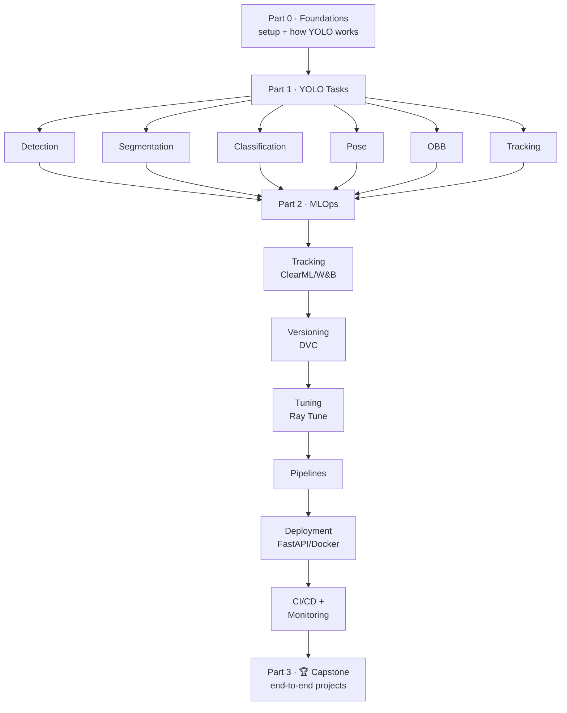

# 🎯 YOLO + MLOps — The Complete Roadmap (0 → Hero)

> **One single source of truth** for learning **YOLO** (all tasks: detect, segment, classify,
> pose, OBB, track) **and** wrapping it in a production-grade **MLOps** workflow — from
> absolute zero, with runnable sample code and datasets for everything.
>
> 📖 **Read this file** top-to-bottom to learn. ▶️ **Run the code** in the matching folder
> (e.g. notes for detection live here in §1.1; the runnable script + dataset live in
> [`01-yolo-tasks/detection/`](01-yolo-tasks/detection/)).

---

## 🧭 How to use this roadmap

- This `roadmap.md` is the **curriculum**: concepts, notes, and inline code snippets.
- Each topic has a **folder** with the standalone runnable script + dataset (fill-in as we go).
- Work **top to bottom**. Part 1 (YOLO) before Part 2 (MLOps) — get models working first.
- Check boxes `[ ]` → `[x]` as you go. This file *is* your progress tracker.
- 🟢 beginner · 🟡 intermediate · 🔴 advanced · ⏱️ time @ ~1 hr/day.

### The module template (every topic follows this)
> **🎯 Goal** · **🧠 Notes/Concepts** · **💻 Sample code** · **📂 Dataset** ·
> **🛠️ Implement it yourself** · **✅ Checklist** · **🔗 Resources**

---

## 🗺️ The big picture



---

## 📑 Table of contents

- [Part 0 — Setup & Foundations](#part-0--setup--foundations-)
- **Part 1 — YOLO Model Training**
  - [1.1 Object Detection](#11-object-detection)
  - [1.2 Instance Segmentation](#12-instance-segmentation)
  - [1.3 Image Classification](#13-image-classification)
  - [1.4 Pose / Keypoint Estimation](#14-pose--keypoint-estimation)
  - [1.5 Oriented Bounding Boxes (OBB)](#15-oriented-bounding-boxes-obb)
  - [1.6 Object Tracking & Counting](#16-object-tracking--counting)
  - [1.7 Cross-cutting skills](#17-cross-cutting-skills-data-augmentation-metrics-export)
- **Part 2 — MLOps for YOLO**
  - [2.1 What is MLOps?](#21-what-is-mlops)
  - [2.2 Experiment Tracking (ClearML & friends)](#22-experiment-tracking)
  - [2.3 Data & Model Versioning (DVC)](#23-data--model-versioning)
  - [2.4 Hyperparameter Optimization](#24-hyperparameter-optimization)
  - [2.5 Pipelines & Orchestration](#25-pipelines--orchestration)
  - [2.6 Deployment & Serving](#26-deployment--serving)
  - [2.7 CI/CD & Monitoring](#27-cicd--monitoring)
- [Part 3 — Capstone Projects](#part-3--capstone-projects-)
- [Appendix: tools, exports, glossary, resources](#-appendix)

---

# Part 0 — Setup & Foundations 🟢
**⏱️ ~1 week** · Folder: [`00-foundations/`](00-foundations/)

### 🎯 Goal
Have a working environment and a clear mental model of what YOLO does.

### 🧠 Notes
- **YOLO = "You Only Look Once"** — a real-time model family for computer-vision tasks.
  Maintained by **Ultralytics** (latest: **YOLO11**, **YOLO26**).
- One library, **six task types** (the heart of Part 1):

  | Task | What it outputs | Model suffix | Demo dataset |
  |------|-----------------|--------------|--------------|
  | Detection | Boxes + labels | `yolo11n.pt` | `coco8.yaml` |
  | Segmentation | Pixel masks | `yolo11n-seg.pt` | `coco8-seg.yaml` |
  | Classification | Whole-image label | `yolo11n-cls.pt` | `mnist160` |
  | Pose | Keypoints (skeleton) | `yolo11n-pose.pt` | `coco8-pose.yaml` |
  | OBB | Rotated boxes | `yolo11n-obb.pt` | `dota8.yaml` |
  | Tracking | Boxes + persistent IDs | *(uses any above)* | any video |

- **Model sizes:** `n` (nano) → `s` → `m` → `l` → `x`. Smaller = faster, larger = more accurate.
- **No GPU needed** to learn — [Google Colab](https://colab.research.google.com) /
  [Kaggle](https://www.kaggle.com/code) give free GPUs.

### 💻 Sample code — install & smoke test
```bash
python -m venv .venv
# Windows:  .venv\Scripts\activate   |   macOS/Linux:  source .venv/bin/activate
pip install ultralytics
```
```bash
# Verify everything works (downloads a tiny model + runs detection on a sample image)
yolo predict model=yolo11n.pt source="https://ultralytics.com/images/bus.jpg"
```

### 🛠️ Implement it yourself
- [ ] Install Python 3.11+, create & activate a virtual environment
- [ ] `pip install ultralytics` and run the smoke test above
- [ ] Open the saved result image in `runs/detect/predict/`
- [ ] (Optional) Skim Python/NumPy basics if you're new to code

### ✅ Checklist
- [ ] Environment activates · [ ] `yolo` command works · [ ] You can explain the 6 task types

### 🔗 Resources
- [Ultralytics Quickstart](https://docs.ultralytics.com/quickstart/) ·
  [Tasks overview](https://docs.ultralytics.com/tasks/) ·
  [freeCodeCamp Python](https://www.youtube.com/watch?v=rfscVS0vtbw)

---

# Part 1 — YOLO Model Training

> The fun part: training models for every kind of vision task. Each section is
> self-contained. The pattern is always the same — **load a model → train → validate →
> predict → export** — only the *task* and *data format* change.

## 1.1 Object Detection
🟢 · **⏱️ ~1 week** · Folder: [`01-yolo-tasks/detection/`](01-yolo-tasks/detection/)

### 🎯 Goal
Draw labelled boxes around objects. The foundational task — master this first.

### 🧠 Notes
- **Label format** (one `.txt` per image): `class_id x_center y_center width height`,
  all **normalized 0–1**. Example: `0 0.51 0.43 0.22 0.18`.
- **Dataset layout:** `images/train`, `images/val`, `labels/train`, `labels/val` + a
  `data.yaml` listing paths and class names.
- **Key metrics:** Precision, Recall, **mAP@50**, **mAP@50-95** (the headline number).

### 💻 Sample code
```python
from ultralytics import YOLO

model = YOLO("yolo11n.pt")                       # pretrained detection model
model.train(data="coco8.yaml", epochs=50, imgsz=640, batch=16)  # train
metrics = model.val()                            # evaluate → mAP, precision, recall
model.predict("https://ultralytics.com/images/bus.jpg", save=True)  # inference
model.export(format="onnx")                      # export for deployment
```

### 📂 Dataset
- Learn: `coco8.yaml` (8 images, auto-downloads). Real: build your own with
  [Roboflow](https://roboflow.com/) / [Label Studio](https://labelstud.io/) → export YOLO format.

### 🛠️ Implement it yourself
- [ ] Train on `coco8`, read the `mAP50-95`
- [ ] Collect 30–50 of your own images, annotate them, write `data.yaml`
- [ ] Train on YOUR data, then run detection on a new image / webcam (`source=0`)

### ✅ Checklist
- [ ] Decode a label file by hand · [ ] Train custom model · [ ] Read mAP · [ ] Export to ONNX

### 🔗 Resources
- [Detect task](https://docs.ultralytics.com/tasks/detect/) ·
  [Detection datasets](https://docs.ultralytics.com/datasets/detect/) ·
  [Metrics guide](https://docs.ultralytics.com/guides/yolo-performance-metrics/)

---

## 1.2 Instance Segmentation
🟡 · **⏱️ ~4–5 days** · Folder: [`01-yolo-tasks/segmentation/`](01-yolo-tasks/segmentation/)

### 🎯 Goal
Outline objects at the **pixel** level (masks), not just boxes.

### 🧠 Notes
- **Label format:** `class_id x1 y1 x2 y2 … xn yn` — a **polygon** of normalized points.
- Detection vs. segmentation: a box says *"a dog is here-ish"*; a mask says *"these exact
  pixels are dog."* Used in medical imaging, robotics, photo editing.
- Same training API, model suffix `-seg`.

### 💻 Sample code
```python
from ultralytics import YOLO

model = YOLO("yolo11n-seg.pt")
model.train(data="coco8-seg.yaml", epochs=50, imgsz=640)
results = model.predict("https://ultralytics.com/images/bus.jpg", save=True)
masks = results[0].masks          # the pixel masks
```

### 📂 Dataset
`coco8-seg.yaml` to learn · annotate polygons in Roboflow/CVAT for custom data.

### 🛠️ Implement it yourself
- [ ] Train on `coco8-seg`, visualize the masks
- [ ] Annotate 20 images with polygons, train, compare mask quality

### ✅ Checklist
- [ ] Explain box vs. mask · [ ] Train a `-seg` model · [ ] Access `.masks` in code

### 🔗 Resources
- [Segment task](https://docs.ultralytics.com/tasks/segment/) ·
  [Segmentation datasets](https://docs.ultralytics.com/datasets/segment/)

---

## 1.3 Image Classification
🟢 · **⏱️ ~3 days** · Folder: [`01-yolo-tasks/classification/`](01-yolo-tasks/classification/)

### 🎯 Goal
Label a **whole image** with one class (no boxes). The simplest task — great warm-up.

### 🧠 Notes
- **No label files!** Data is organized by **folders**: `train/cat/*.jpg`, `train/dog/*.jpg`.
  The folder name *is* the label.
- **Metric:** top-1 / top-5 accuracy.
- Model suffix `-cls`. Pass a dataset **directory** (or name) instead of a `.yaml`.

### 💻 Sample code
```python
from ultralytics import YOLO

model = YOLO("yolo11n-cls.pt")
model.train(data="mnist160", epochs=20, imgsz=64)   # 'mnist160' auto-downloads
result = model.predict("path/to/image.jpg")
print(result[0].probs.top1)                          # predicted class index
```

### 📂 Dataset
`mnist160` or `imagenette` to learn · for custom, make `train/<class>/` + `val/<class>/` folders.

### 🛠️ Implement it yourself
- [ ] Train on `mnist160`
- [ ] Build a 2–3 class folder dataset of your own (e.g., `pizza/`, `burger/`), train, test

### ✅ Checklist
- [ ] Explain folder-as-label · [ ] Train a classifier · [ ] Read top-1 accuracy

### 🔗 Resources
- [Classify task](https://docs.ultralytics.com/tasks/classify/) ·
  [Classification datasets](https://docs.ultralytics.com/datasets/classify/)

---

## 1.4 Pose / Keypoint Estimation
🟡 · **⏱️ ~4–5 days** · Folder: [`01-yolo-tasks/pose/`](01-yolo-tasks/pose/)

### 🎯 Goal
Detect **keypoints** (e.g., human joints) and connect them into a skeleton.

### 🧠 Notes
- **Label format:** box + a list of keypoints `px py visibility` per point.
  COCO human pose uses **17 keypoints** (nose, shoulders, elbows, knees…).
- Use cases: fitness apps, sports analytics, gesture control, fall detection.
- Model suffix `-pose`.

### 💻 Sample code
```python
from ultralytics import YOLO

model = YOLO("yolo11n-pose.pt")
model.train(data="coco8-pose.yaml", epochs=50, imgsz=640)
results = model.predict("https://ultralytics.com/images/bus.jpg", save=True)
keypoints = results[0].keypoints      # x,y per joint
```

### 📂 Dataset
`coco8-pose.yaml` to learn · annotate keypoints in CVAT/Roboflow for custom skeletons.

### 🛠️ Implement it yourself
- [ ] Run pose on a photo of people, inspect the 17 keypoints
- [ ] Run pose on your **webcam** (`source=0`) in real time

### ✅ Checklist
- [ ] Explain keypoints + visibility · [ ] Train a `-pose` model · [ ] Access `.keypoints`

### 🔗 Resources
- [Pose task](https://docs.ultralytics.com/tasks/pose/) ·
  [Pose datasets](https://docs.ultralytics.com/datasets/pose/)

---

## 1.5 Oriented Bounding Boxes (OBB)
🔴 · **⏱️ ~3–4 days** · Folder: [`01-yolo-tasks/obb/`](01-yolo-tasks/obb/)

### 🎯 Goal
Draw **rotated** boxes — essential when objects aren't axis-aligned (aerial/satellite
images, documents, ships, vehicles from above).

### 🧠 Notes
- **Label format:** 4 corner points `x1 y1 x2 y2 x3 y3 x4 y4` (normalized) → a rotated rectangle.
- A normal box wastes space on a tilted object; an OBB hugs it tightly.
- Model suffix `-obb`. Benchmark dataset: **DOTA** (aerial imagery).

### 💻 Sample code
```python
from ultralytics import YOLO

model = YOLO("yolo11n-obb.pt")
model.train(data="dota8.yaml", epochs=50, imgsz=640)
results = model.predict("path/to/aerial.jpg", save=True)
obb = results[0].obb                  # rotated-box outputs
```

### 📂 Dataset
`dota8.yaml` (small DOTA sample) to learn · annotate rotated boxes in Roboflow for custom data.

### 🛠️ Implement it yourself
- [ ] Train on `dota8`, visualize rotated boxes
- [ ] Compare OBB vs. normal detection on the same tilted-object image

### ✅ Checklist
- [ ] Explain when OBB beats a normal box · [ ] Train an `-obb` model

### 🔗 Resources
- [OBB task](https://docs.ultralytics.com/tasks/obb/) ·
  [DOTA dataset](https://docs.ultralytics.com/datasets/obb/)

---

## 1.6 Object Tracking & Counting
🟡 · **⏱️ ~1 week** · Folder: [`01-yolo-tasks/tracking/`](01-yolo-tasks/tracking/)

### 🎯 Goal
Follow objects **across video frames** with persistent IDs — then count them, measure
speed, or analyze trajectories.

### 🧠 Notes
- Tracking is **not a separate training task** — it adds a *tracker* on top of any
  detection/seg/pose model. Trackers: **ByteTrack**, **BoT-SORT**.
- `persist=True` keeps IDs stable between frames.
- This is where CV gets *real*: people counting, traffic analytics, queue monitoring.

### 💻 Sample code
```python
from ultralytics import YOLO

model = YOLO("yolo11n.pt")
# Track on a video (or source=0 for webcam); each object gets a stable ID
results = model.track(source="people.mp4", tracker="bytetrack.yaml",
                      persist=True, save=True)
```
> 💡 Counting: use Ultralytics `solutions.ObjectCounter` with a line/region to tally
> objects crossing it. See the solutions guide below.

### 📂 Dataset
No training data needed to start — just any **video**. (Train the underlying detector on
custom data if you need custom classes.)

### 🛠️ Implement it yourself
- [ ] Track objects in a sample video, watch the IDs
- [ ] Count objects crossing a line (e.g., cars on a road, people through a door)

### ✅ Checklist
- [ ] Explain detection vs. tracking · [ ] Run `.track()` · [ ] Build a counter

### 🔗 Resources
- [Track mode](https://docs.ultralytics.com/modes/track/) ·
  [Solutions (counting, speed, heatmaps)](https://docs.ultralytics.com/solutions/)

---

## 1.7 Cross-cutting skills (data, augmentation, metrics, export)
🟡 · **⏱️ ~ongoing** · Folder: [`01-yolo-tasks/`](01-yolo-tasks/)

### 🧠 Notes — the skills you reuse in every task
- **Custom data + annotation:** Roboflow (easiest), Label Studio / CVAT (open-source).
  Always export in the **YOLO format** for the task.
- **Train/val/test split:** never evaluate on data you trained on.
- **Augmentation:** mosaic, flip, HSV, scale — built into Ultralytics; improves robustness.
- **Reading results:** the `runs/<task>/train/` folder has `results.png` (loss/metric
  curves), `confusion_matrix.png`, and weights (`best.pt`, `last.pt`).
- **Export formats:** `model.export(format=...)` → `onnx`, `engine` (TensorRT),
  `openvino`, `coreml`, `tflite`, `torchscript`. (Deep dive in §2.6.)
- **Overfitting:** train loss ↓ but val metrics ↓ = memorizing. Fight with more data,
  augmentation, and early stopping (`patience`).

### 🔗 Resources
- [Train mode + all args](https://docs.ultralytics.com/modes/train/) ·
  [Augmentation](https://docs.ultralytics.com/guides/yolo-data-augmentation/) ·
  [Export mode](https://docs.ultralytics.com/modes/export/)

> ✋ **Checkpoint:** If you can train any of the 6 tasks, read its metrics, and run it on a
> webcam/video — you understand YOLO. Now make it **reproducible, deployable, and
> monitored**: welcome to MLOps. 👇

---

# Part 2 — MLOps for YOLO

## 2.1 What is MLOps?
🟡 · **⏱️ ~3 days** · Folder: [`02-mlops/`](02-mlops/)

### 🎯 Goal
Understand the problem before the tools.

### 🧠 Notes
- You trained a great model. But: *Which data version? What hyperparameters? Can a
  teammate reproduce it? How do you deploy it? Is it still accurate next month?*
- **MLOps = DevOps for ML** — practices/tools to make ML **reproducible, automated,
  deployable, and monitored**.
- The lifecycle: `Data → Experiment → Train → Evaluate → Version → Deploy → Monitor → ↺`.
- The 5 pillars (next sections): tracking · versioning · tuning · orchestration ·
  deploy+monitor.

### 🔗 Resources
- [Google: MLOps](https://cloud.google.com/architecture/mlops-continuous-delivery-and-automation-pipelines-in-machine-learning) ·
  [Made With ML](https://madewithml.com/) · [ml-ops.org](https://ml-ops.org/)

---

## 2.2 Experiment Tracking
🟡 · **⏱️ ~2 weeks** · Folder: [`02-mlops/clearml/`](02-mlops/clearml/), [`wandb/`](02-mlops/wandb/), [`mlflow/`](02-mlops/mlflow/)

### 🎯 Goal
Auto-record every training run (settings, metrics, plots, model) so you never lose work.
**The first MLOps habit to build.** Ultralytics integrates these with near-zero code.

### 🧠 Notes — ClearML (primary ⭐)
Open-source, all-in-one: tracking + dataset versioning + remote agents + HPO.
Three pieces: the `clearml` **library**, a **server** (free hosted at app.clear.ml), and a
**web dashboard**. A **Task** = one tracked run.

### 💻 Sample code — ClearML
```bash
pip install clearml && clearml-init   # paste credentials from app.clear.ml → Settings
```
```python
from clearml import Task
from ultralytics import YOLO

task = Task.init(project_name="YOLO-MLOps", task_name="run-1")
model = YOLO("yolo11n.pt")
model.train(data="coco8.yaml", epochs=16)   # auto-tracked in the dashboard 🎉
```

### 🧠 Notes — the alternatives (try 2–3, pick favorites)
| Tool | Install | Vibe |
|------|---------|------|
| **Weights & Biases** | `pip install wandb` | Polished UI, hugely popular |
| **MLflow** | `pip install mlflow` | Open-source standard, model registry |
| **Comet** | `pip install comet_ml` | Clean tracking & comparison |
| **TensorBoard** | built-in | Lightweight, local, no account |

### 🛠️ Implement it yourself
- [ ] Run a YOLO training tracked in **ClearML**; explore the dashboard
- [ ] Run the same training tracked in **W&B**; compare the experience
- [ ] Compare two runs side-by-side in either tool

### ✅ Checklist
- [ ] Explain the 3 ClearML pieces · [ ] Track a run · [ ] Compare runs · [ ] Tried an alternative

### 🔗 Resources
- [Ultralytics × ClearML](https://docs.ultralytics.com/integrations/clearml) ·
  [× W&B](https://docs.ultralytics.com/integrations/weights-biases) ·
  [× MLflow](https://docs.ultralytics.com/integrations/mlflow) ·
  [× Comet](https://docs.ultralytics.com/integrations/comet)

---

## 2.3 Data & Model Versioning
🟡 · **⏱️ ~1 week** · Folder: [`02-mlops/dvc/`](02-mlops/dvc/)

### 🎯 Goal
Version datasets and model weights like you version code (Git can't handle big files).

### 🧠 Notes
- **DVC** = "Git for data." Tracks large files via small pointer files; stores the actual
  data in a remote (S3, Google Drive, etc.).
- **ClearML Data** (`clearml-data`) does versioning inside ClearML.
- **Model registry:** version trained weights (MLflow Registry / ClearML) and tie each
  model back to its exact data + code.

### 💻 Sample code — DVC
```bash
pip install dvc
dvc init
dvc add data/my_dataset           # creates data/my_dataset.dvc (small pointer)
git add data/my_dataset.dvc .gitignore && git commit -m "track dataset v1"
dvc remote add -d storage gdrive://<folder-id>   # push data to remote
dvc push
```

### 🛠️ Implement it yourself
- [ ] Version your custom dataset with DVC, push to a Google Drive remote
- [ ] Change the data, commit v2, then `dvc checkout` an old version (roll back)

### ✅ Checklist
- [ ] Explain why Git ≠ data versioning · [ ] `dvc add` + `push` · [ ] Roll back a version

### 🔗 Resources
- [Ultralytics × DVC](https://docs.ultralytics.com/integrations/dvc) ·
  [DVC Get Started](https://dvc.org/doc/start)

---

## 2.4 Hyperparameter Optimization
🔴 · **⏱️ ~1 week** · Folder: [`02-mlops/hpo/`](02-mlops/hpo/)

### 🎯 Goal
Let the machine find better hyperparameters than you can by hand.

### 🧠 Notes
- Small changes to learning rate / augmentation → big mAP swings.
- Strategies: grid, random, Bayesian, **genetic evolution**.
- Options: **Ultralytics built-in tuner** (`model.tune`), **Ray Tune** (distributed),
  **ClearML HPO**.

### 💻 Sample code
```python
from ultralytics import YOLO

model = YOLO("yolo11n.pt")
model.tune(data="coco8.yaml", epochs=30, iterations=10, optimizer="AdamW")
```

### 🛠️ Implement it yourself
- [ ] Run a tuning sweep, then compare the runs in your tracker from §2.2

### ✅ Checklist
- [ ] Explain why HPO matters · [ ] Run a sweep · [ ] Identify best hyperparameters

### 🔗 Resources
- [Hyperparameter tuning](https://docs.ultralytics.com/guides/hyperparameter-tuning/) ·
  [× Ray Tune](https://docs.ultralytics.com/integrations/ray-tune)

---

## 2.5 Pipelines & Orchestration
🔴 · **⏱️ ~1–2 weeks** · Folder: [`02-mlops/`](02-mlops/)

### 🎯 Goal
Automate multi-step workflows (data → train → eval → register) and run jobs on remote GPUs.

### 🧠 Notes
- A **pipeline** chains steps with dependencies, as code.
- **ClearML Agent:** queue a job, run it on a remote GPU ("ML-as-a-service").
- **ClearML Pipelines** chain tasks. Know the names: **Kubeflow**, **Airflow**,
  **Metaflow**, **Prefect**.
- Intro to **Docker** here — containerize the training environment.

### 🛠️ Implement it yourself
- [ ] Set up a ClearML Agent on a free Colab GPU; enqueue a training job from your laptop

### ✅ Checklist
- [ ] Explain a pipeline · [ ] Enqueue a remote job

### 🔗 Resources
- [ClearML Agent](https://clear.ml/docs/latest/docs/clearml_agent/) ·
  [ClearML Pipelines](https://clear.ml/docs/latest/docs/pipelines/)

---

## 2.6 Deployment & Serving
🔴 · **⏱️ ~2 weeks** · Folder: [`02-mlops/deployment/`](02-mlops/deployment/)

### 🎯 Goal
Get your model out of the notebook and into the real world.

### 🧠 Notes
- **Export** for the target: `onnx` (portable), `engine` (TensorRT, NVIDIA speed),
  `openvino` (Intel), `coreml` (Apple), `tflite` (mobile/edge).
- **Serve** with a REST API (**FastAPI**), package with **Docker**.
- Dedicated servers: **Triton**, **BentoML**, **LitServe**. Edge: Raspberry Pi, Jetson.

### 💻 Sample code
```bash
yolo export model=best.pt format=onnx      # → best.onnx
```
```python
# Minimal FastAPI inference endpoint (sketch)
from fastapi import FastAPI, UploadFile
from ultralytics import YOLO

app = FastAPI(); model = YOLO("best.pt")

@app.post("/predict")
async def predict(file: UploadFile):
    img = await file.read()
    r = model.predict(img)
    return r[0].to_json()
```

### 🛠️ Implement it yourself
- [ ] Export your best model to ONNX
- [ ] Serve it via FastAPI, hit `/predict` with an image
- [ ] Dockerize the API and run the container

### ✅ Checklist
- [ ] Export to ≥1 format · [ ] Working API · [ ] Runs in Docker

### 🔗 Resources
- [Export mode](https://docs.ultralytics.com/modes/export/) ·
  [Deployment options](https://docs.ultralytics.com/guides/model-deployment-options/) ·
  [FastAPI](https://fastapi.tiangolo.com/)

---

## 2.7 CI/CD & Monitoring
🔴 · **⏱️ ~1–2 weeks** · Folder: [`02-mlops/cicd-monitoring/`](02-mlops/cicd-monitoring/)

### 🎯 Goal
Automate the whole loop and watch models in production.

### 🧠 Notes
- **CI/CD for ML** with **GitHub Actions**: auto-validate on every push; fail the build if
  mAP drops below a threshold.
- **Monitoring:** data drift, concept drift, performance decay. Tools: **Evidently AI**,
  **Prometheus + Grafana**, tracker alerts.
- **Retraining loop:** when & how to retrain automatically.

### 💻 Sample code — GitHub Actions (sketch)
```yaml
# .github/workflows/validate.yml
on: [push]
jobs:
  validate:
    runs-on: ubuntu-latest
    steps:
      - uses: actions/checkout@v4
      - run: pip install ultralytics
      - run: python scripts/check_map.py   # fails build if mAP < threshold
```

### 🛠️ Implement it yourself
- [ ] Add a GitHub Action that validates the model on every push
- [ ] Simulate data drift and detect it with Evidently AI

### ✅ Checklist
- [ ] Explain drift · [ ] Working CI check · [ ] Detected drift once

### 🔗 Resources
- [GitHub Actions](https://docs.github.com/en/actions) ·
  [Evidently AI](https://www.evidentlyai.com/) · [CML](https://cml.dev/)

---

# Part 3 — Capstone Projects 🏆
**⏱️ ~2–4 weeks each** · Folder: [`capstone/`](capstone/)

Combine a YOLO task with the **full MLOps stack**. Pick one, build it end-to-end, document it.

| Project | YOLO task | MLOps showcased |
|---------|-----------|-----------------|
| 🚗 **Traffic analytics** | Detection + Tracking | Tracking, counting, FastAPI dashboard, Docker |
| 🦺 **PPE safety checker** | Detection | Custom data + DVC, ClearML tracking, CI/CD gate |
| 🧍 **Fitness rep counter** | Pose | Real-time webcam, deployment, monitoring |
| ♻️ **Recycling sorter** | Classification/Detection | Edge export (TFLite), retraining loop |
| 🛰️ **Aerial object finder** | OBB | DVC dataset, HPO, ONNX serving |

**Every capstone must include:** custom dataset → DVC versioning → tracked training (ClearML)
→ HPO → export + FastAPI/Docker serving → GitHub Actions CI + drift monitoring → a README
with metrics, screenshots, and a demo GIF.

> 🎓 One finished end-to-end project beats ten tutorials. **This is your portfolio.**

---

# 📚 Appendix

## 🧰 Recommended starter stack
```
Modeling:    Ultralytics YOLO (yolo11 / yolo26)
Tracking:    ClearML  (or Weights & Biases)
Versioning:  DVC
Tuning:      Ultralytics tuner → Ray Tune
Serving:     FastAPI + ONNX + Docker
CI/CD:       GitHub Actions
Monitoring:  Evidently AI
Compute:     Colab / Kaggle (free GPU) → cloud later
```

## 📊 MLOps tools cheat-sheet
| Need | Tools | Beginner pick |
|------|-------|:---:|
| Experiment tracking | ClearML, W&B, MLflow, Comet, Neptune, TensorBoard | ClearML / W&B |
| Data/model versioning | DVC, ClearML Data | DVC |
| Hyperparameter tuning | Ultralytics tuner, Ray Tune, ClearML HPO | Built-in tuner |
| Orchestration | ClearML, Kubeflow, Airflow, Metaflow, Prefect | ClearML |
| Model registry | MLflow, ClearML | MLflow |
| Serving | FastAPI, Triton, BentoML, LitServe | FastAPI |
| Monitoring | Evidently AI, Prometheus+Grafana | Evidently |
| CI/CD | GitHub Actions, CML | GitHub Actions |

## 📦 Export formats
| Format | Command | Best for |
|--------|---------|----------|
| ONNX | `format=onnx` | Portable, cross-platform |
| TensorRT | `format=engine` | NVIDIA GPUs (fastest) |
| OpenVINO | `format=openvino` | Intel CPUs |
| CoreML | `format=coreml` | Apple devices |
| TFLite | `format=tflite` | Mobile / edge |
| TorchScript | `format=torchscript` | C++ / production PyTorch |

## 📖 Glossary
| Term | Meaning |
|------|---------|
| Inference | Using a trained model to predict |
| Epoch | One full pass over the training data |
| mAP | mean Average Precision — main detection metric |
| IoU | Intersection over Union — box overlap |
| Augmentation | Random image transforms to improve robustness |
| Overfitting | Memorizes training data, fails on new data |
| Hyperparameter | A setting chosen before training (lr, batch…) |
| MLOps | Practices/tools for reproducible, deployable ML |
| Drift | Real-world data changes → model degrades over time |
| ONNX | Portable, framework-agnostic model format |
| Pipeline | Automated multi-step ML workflow as code |

## 🔗 Master resources
- **Official:** [Ultralytics Docs](https://docs.ultralytics.com/) ·
  [Tasks](https://docs.ultralytics.com/tasks/) ·
  [Integrations](https://docs.ultralytics.com/integrations/) ·
  [ClearML Docs](https://clear.ml/docs/)
- **Courses:** [Made With ML](https://madewithml.com/) ·
  [MLOps Zoomcamp](https://github.com/DataTalksClub/mlops-zoomcamp) ·
  [fast.ai](https://course.fast.ai/)
- **Data & practice:** [Roboflow Universe](https://universe.roboflow.com/) ·
  [Kaggle](https://www.kaggle.com/) · [Papers With Code](https://paperswithcode.com/task/object-detection)

---

## ✅ Progress tracker
**Part 1 — YOLO:**
`[ ]` Detection · `[ ]` Segmentation · `[ ]` Classification · `[ ]` Pose · `[ ]` OBB · `[ ]` Tracking
**Part 2 — MLOps:**
`[ ]` Tracking · `[ ]` Versioning · `[ ]` HPO · `[ ]` Pipelines · `[ ]` Deployment · `[ ]` CI/CD
**Part 3:** `[ ]` Capstone shipped 🚀

---

*Living document · created 2026-06-26 · update the checkboxes as you learn. Build > read.*
